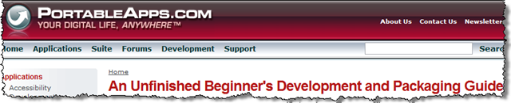

# An Unfinished Guide...

I've been setting up Portable Apps on my flash drive (after successfully removing U3 & reformatting it), and I was browsing around their site when I found the documentation for developers. So, I thought I would take and adapt the title ("[An Unfinished Beginner's Development and Packaging Guide](http://portableapps.com/development/beginner_packaging)") and apply it to the stuff I'm going to write up for DMIT152, Application Programming.

