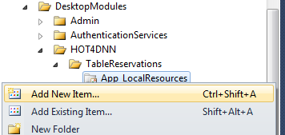
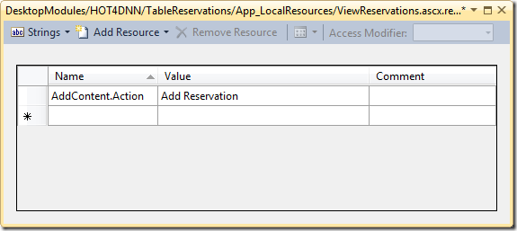
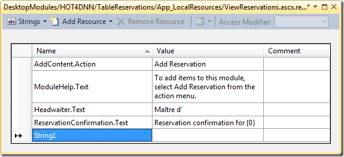

# Developing View User Controls for your DotNetNuke® Module

---
## Developing View User Controls for your DotNetNuke® Module

Part of creating module extensions for the DotNetNuke® framework involves developing a user interface (UI). Almost every module UI will include a user control to view the module's content. This article walks through three key pieces to developing a **View** user control for standard module extensions: Inheriting from *PortalModuleBase*, implementing *IActionable* and using *Resource Files*.

 

This article is part of a suite of articles on module development basics.

 
- Module Extensions – Building the UI  
 - [UserControlBase](http://www.hot4dnn.com/Articles/tabid/62/articleType/ArticleView/articleId/40/UserControlBase-ndash-Under-the-Hood.aspx) - [PortalModuleBase](http://www.hot4dnn.com/Articles/tabid/62/articleType/ArticleView/articleId/47/PortalModuleBase-ndash-Under-the-Hood.aspx) - [ModuleSettingsBase](http://www.hot4dnn.com/Articles/tabid/62/articleType/ArticleView/articleId/41/ModuleSettingsBase-ndash-Under-the-Hood.aspx) - [ModuleInstanceContext](http://www.hot4dnn.com/Articles/tabid/62/articleType/ArticleView/articleId/42/ModuleInstanceContext-ndash-Under-the-Hood.aspx) - [View Controls](http://www.hot4dnn.com/Articles/tabid/62/articleType/ArticleView/articleId/43/Developing-View-User-Controls-for-your-DotNetNuke-Module.aspx) - [Edit Controls](http://www.hot4dnn.com/Articles/tabid/62/articleType/ArticleView/articleId/44/Developing-Edit-User-Controls-for-your-DotNetNukereg-Module.aspx) - [Settings Control](http://www.hot4dnn.com/Articles/tabid/62/articleType/ArticleView/articleId/45/Developing-a-Settings-User-Control-for-your-DotNetNukereg-Module.aspx) - [Resource Files (.resx)](http://www.hot4dnn.com/Articles/tabid/62/articleType/ArticleView/articleId/46/Working-with-Resource-Files-resx-in-your-DotNetNukereg-Module.aspx)

 - Module Extensions – Building the Back End  
 - [Building a Business Controller Class](http://www.hot4dnn.com/Articles/tabid/62/articleType/ArticleView/articleId/49/Building-a-Business-Controller-Class.aspx) - [CBOs – Your Module-Specific "Info" Classes](http://www.hot4dnn.com/Articles/tabid/62/articleType/ArticleView/articleId/50/CBOs-ndash-Your-Module-Specific-ldquoInfordquo-Classes.aspx) - [Building Your Module's Data Access Layer](http://www.hot4dnn.com/Articles/tabid/62/articleType/ArticleView/articleId/51/Building-Your-Modulersquos-Data-Access-Layer.aspx) - [Designing Database Tables for DNN Modules](http://www.hot4dnn.com/Articles/tabid/62/articleType/ArticleView/articleId/52/Designing-Database-Tables-for-DNN-Modules.aspx)

# Developing View User Controls
 

DotNetNuke® module extensions typically fill the role of managing specific types of content. For example, the HTML module is responsible for managing general-purpose HTML content. Likewise, the Announcements module is meant to manage (surprise, surprise) announcements; this module effectively defines an "announcement" as being made up of a title, a description, and some optional links and start/end dates.

 

Three types of user controls (.ascx) act as the central players in the user interface for DNN® module extensions.

 
- **View** – This acts to display or present the module's content to users with permission to view the module.  - **Edit** – This provides a means to create or modify the module's content. It can only be accessed by users with permission to edit the module.  - **Settings** – This allows users with edit permissions to manage settings that are unique to the type of module. These module-specific settings typically control aspects of the module's behaviour in managing or presenting the module's content.

 

This article walks through three key pieces to include when creating a **View** user control for your module. In general, a typical View user control will a) inherit from PortalModuleBase, b) implement IActionable, and c) use a Resource File (.resx) in place of hard-coded strings in the UI.

 
## Inherits PortalModuleBase
 

Typically, an ASP.NET user control will inherit from [System.Web.UI.UserControl](http://msdn.microsoft.com/en-us/library/system.web.ui.usercontrol.aspx). This is fine when creating user controls for an ordinary website. Because the DotNetNuke framework is much more than an ordinary website, a module's user controls will typically inherit from a class called **PortalModuleBase** (which is in the DotNetNuke.Entities.Modules namespace).

 

To create your view control, simply follow these steps.

 
1. Right-click on your module's folder and select "Add New Item…".   
[")](images/image.png)- In the Add New Item dialog, select the Web User Control template and give it a name. For example, if your module manages Reservations, you could call it "ViewReservations.ascx".    
[")](images/SNAGHTML22904d.png)- In the control's code-behind, replace the UserControl base class with PortalModuleBase. (Don't forget to include the DotNetNuke.Entities.Modules namespace.)   
 
Partial Class ViewReservations

<!--CRLF-->

        Inherits DotNetNuke.Entities.Modules.PortalModuleBase ' System.Web.UI.UserControl

<!--CRLF-->

    &nbsp;

<!--CRLF-->

    End Class

<!--CRLF-->

 

 

PortalModuleBase has over 25 properties and a few methods. These properties provide information about the portal in which your module resides. This includes information about the page (or Tab) into which the module has been loaded, the portal instance that holds the page, and the user who has made the page request. Because your View control inherits from PortalModuleBase, all this information is readily accessible as you develop your module, and that greatly simplifies your efforts.

 

For example, if part of your View module needs the DisplayName of the user, you can get it by simply calling UserInfo.DisplayName in your code.

 
ReservationName.Text = UserInfo.DisplayName

<!--CRLF-->
 

Here's a short list of some notable properties you get from PortalModuleBase.

 
- **EditMode** – (ReadOnly) This boolean value is set to true if the current user is an administrator of the page (and therefore has Edit permissions on the module).  - **IsEditable** – (ReadOnly) This boolean property checks to see if the page can be edited. DotNetNuke uses this to determine whether or not to show the Action menu when rendering the module on the page. To be editable, the page must be rendered in Edit or Layout mode and the user must have Edit rights to the module.  - **LocalResourceFile** – This is the complete path to the resource file (.resx) for the user control.  - **ModuleId** – This is the ID of this particular instance of the module. (Remember, any module extension may be added several times to a portal; each new instance is given a unique ModuleId.)  - **PortalId** – This ID represents the particular portal (website) instance inside the DotNetNuke web application. (DotNetNuke supports the concept of hosting multiple web sites in a single installation.)  - **Settings** – This is a Hashtable (key-value) collection of module settings that are specific to your module. It includes both the ModuleSettings and TabModuleSettings.  - **TabId** – This is the ID of the tab (page) on which the module resides.  - **TabModuleId** – The TabModuleId differs from the ModuleId in that the TabModuleId is unique for modules that are "shared" (or "mirrored") between tabs.  - **UserId** – This is the ID of the logged-in user currently accessing the module/page.  - **UserInfo** – This object contains all the information about the logged in user, such as their UserId, UserName, and DisplayName. It also includes an array of the names of roles to which the user belongs as well as other information on the user's profile. For performance reasons, some of the information (such as the Profile data) is "lazy-loaded", meaning that the values are only retrieved when needed. For anonymous users, this object is set to Nothing (null).

 

PortalModuleBase itself ultimately winds up inheriting from System.Web.UI.UserControl (as do all user controls), but it adds to your user control a wealth of information about the DNN framework in which your module resides. There is a lot to this base class (and the UserControlBase that it inherits from), and it would take too much space to discuss all it offers. You can learn more about PortalModuleBase (and UserControlBase) in the links at the end of this article.

 
## Implements IActionable
 

 

**IActionable** is an optional interface (from the DotNetNuke.Entities.Modules namespace) which defines a single read only property called **ModuleActions**. This property is called by the DotNetNuke framework in order to get your module's custom "actions" to display in the Actions menu.

 

 

An "action" is simply something that can be performed on or by a module, such as deleting the module or moving it around on the page. These are displayed as links in the module's Actions menu. The Actions menu is presented whenever the user has Edit permissions on that module. A number of actions are pre-defined by the DNN framework: moving the module on the page, deleting it, or editing its settings. You can add your own module-specific actions to this menu by implementing IActionable on your View user control.

 

Your module implements this interface by building a **ModuleActionCollection** for the ModuleActions property. This collection holds information about the action you want to support, such as navigating to other user controls in your module. You can add an item to this collection when you want a link to a user control to appear in the Actions menu. The order in which you add items will affect the order in which they are displayed in the Actions menu (above those pre-defined through the PortalModuleBase base class).

 

To support IActionable, follow these steps.

 
1. Modify your class definition to state that you are implementing IActionable. (Remember to import the DotNetNuke.Entities.Modules namespace.)    
 
Partial Class ViewReservations

<!--CRLF-->

        Inherits DotNetNuke.Entities.Modules.PortalModuleBase

<!--CRLF-->

        Implements DotNetNuke.Entities.Modules.IActionable

<!--CRLF-->
 - Code a ReadOnly property called ModuleActions.    
 
Public ReadOnly Property ModuleActions As ModuleActionCollection Implements IActionable.ModuleActions

<!--CRLF-->

        Get

<!--CRLF-->

            ' Add ModuleAction objects to a new ModuleActionCollection

<!--CRLF-->

        End Get

<!--CRLF-->

    End Property

<!--CRLF-->
 - Add items to the ModuleActionCollection of your property.    
 
Public ReadOnly Property ModuleActions As ModuleActionCollection Implements IActionable.ModuleActions

<!--CRLF-->

        Get

<!--CRLF-->

            Dim Actions As New ModuleActionCollection()

<!--CRLF-->

            Actions.Add(GetNextActionID(), Localization.GetString(ModuleActionType.AddContent, LocalResourceFile), _

<!--CRLF-->

                        ModuleActionType.AddContent, "", "", EditUrl(), False, SecurityAccessLevel.Edit, _

<!--CRLF-->

                        True, False)

<!--CRLF-->

            Return Actions

<!--CRLF-->

        End Get

<!--CRLF-->

    End Property

<!--CRLF-->

 

Items in the ModuleActionCollection are objects of type DotNetNuke.Entities.Modules.Actions.**ModuleAction**. Each ModuleAction object has the following properties.

 
- **Actions** – A ModuleAction can itself contain a ModuleActionCollection. It's helpful to think of a ModuleAction as a menu item that may have sub-menu items. Together, these form a hierarchy of menu items.  - **ID** – An Integer that uniquely identifies the ModuleAction and that is used to form the parent/child relationships in the Action Menu hierarchy.  - **Visible** – A Boolean that determines if the action should be displayed in the Action Menu. A value of false means that it's always hidden. A value of true means that it *might* be displayed, as long as the user fits the security access level.  - **Secure** – This is an enumerated value of type DotNetNuke.Security.SecurityAccessLevel. It's used to identify the level of access rights required to view and use this ModuleAction. These are the possible values: ControlPanel, SkinObject, Anonymous, View, Edit, Admin, and Host.  - **CommandName** – A string that identifies the ModuleAction. When a user chooses a ModuleAction from the Action menu, a "module action event" is generated and all the information about the event is packaged in this ModuleAction object. This event is captured by the DotNetNuke framework, but you can elect to handle the event in your own module. For example, if you wanted to provide sorting in your module, you could use "Sort" as the command name; then you could handle action events and check the CommandName for the value "Sort".  - **CommandArgument** – A string that holds an optional argument value that can be examined when handling the action event. It works in conjuncture with the CommandName property. For example, if your module supported sorting (where CommandName equals "Sort"), the CommandArgument might have a string indicating the direction ("Ascending" or "Descending") or the name of some property to sort by (such as "ReservationTime" or "Name" for a ReservationInfo object).  - **Title** – A string value that is shown in the menu when the ModuleAction is displayed to the user.  - **Icon** – The URL of an icon image to show alongside the Title in the action menu.  - **Url** – An address that is used for redirecting the page request when this item is selected from the action menu. If this property has a value, then a Module Action Event is not raised. If no value is supplied for this, then an action event is raised which can then be handled by your module.  - **ClientScript** – This is a string containing Javascript that can be run in the client's browser when the menu item has been selected. It's run before the postback, and the client script can cancel the postback event by returning false.  - **UseActionEvent** – This Boolean value indicates whether or not to raise a Menu Action Event when this ModuleAction item is selected by the user. When it is set to true, the action event is raised (even if the Url property is set). If UseActionEvent is false and Url is not empty, then no action event is triggered; if Url is empty, a menu action event is always raised.  - **NewWindow** – This Boolean value indicates whether the action should be performed in or targeted to a new browser window.

 
### Coding the ModuleActions Property
 

The ModuleActionCollection.Add() method supports three overloaded versions which you can call to add items to the collection. One version allows you to add a ModuleAction object (which you would create before calling the Add method). The other two versions of Add() allow you to supply values for the individual ModuleAction properties; these versions then internally create a ModuleAction object before including the item in the collection.

 

A common module action which developers add through the View user control is a link to their user control for creating or editing the module's data. In its most simple form, this requires values for the ID, Title, CommandName, Url, Secure, and Visible properties of the ModuleAction object. Here is a sample of how it could be done by creating the ModuleAction object.

 
Dim Actions As New ModuleActionCollection()

<!--CRLF-->

    &nbsp;

<!--CRLF-->

    Dim EditAction As New ModuleAction(GetNextActionID())

<!--CRLF-->

    EditAction.Title = Localization.GetString(ModuleActionType.AddContent, LocalResourceFile)

<!--CRLF-->

    EditAction.CmdName = ModuleActionType.AddContent

<!--CRLF-->

    EditAction.Url = EditUrl()

<!--CRLF-->

    EditAction.Secure = SecurityAccessLevel.Edit

<!--CRLF-->

    EditAction.Visible = True ' Visible actually defaults to true, so this line isn't strictly needed

<!--CRLF-->

    &nbsp;

<!--CRLF-->

    Actions.Add(EditAction)

<!--CRLF-->
 

The following code produces the same results as the sample above, but it uses an overloaded version of the Add method. Notice that a number of "dummy" values are supplied for the parameters that aren't required for creating the link to the Edit user control.

 
Dim Actions As New ModuleActionCollection()

<!--CRLF-->

    Actions.Add(GetNextActionID(), _

<!--CRLF-->

                Localization.GetString(ModuleActionType.AddContent, LocalResourceFile), _

<!--CRLF-->

                ModuleActionType.AddContent, _

<!--CRLF-->

                "", _

<!--CRLF-->

                "", _

<!--CRLF-->

                EditUrl(), _

<!--CRLF-->

                False, _

<!--CRLF-->

                SecurityAccessLevel.Edit, _

<!--CRLF-->

                True, _

<!--CRLF-->

                False)

<!--CRLF-->
 

Notice how the code samples above make use the DNN framework to supply the values for the ModuleAction object.

 
- The ModuleAction's **ID** is generated by calling the GetNextActionID() method of the View control (this method is defined in PortalModuleBase).  - The **Title** is pulled from the View's resource file (.resx) through the GetString() method of the DotNetNuke.Services.Localization class. GetString() requires two values for it's parameter list; again, the DNN framework is used to help supply the values.  
 - The first value is a string that acts as a key to look up the desired text in the resource file. DotNetNuke provides constants for common keys related to actions; these are in the ModuleActionType class, located in the DotNetNuke.Entities.Modules.Actions namespace. The value for the ModuleActionType.AddContent constant is "AddContent.Action".   - The second parameter's value is a string that provides the path to the resource file. This path is generated through the View's LocalResourceFile property (as defined in PortalModuleBase).

 - The **CommandName** value also uses the constant ModuleActionType.AddContent.  - The **Url** is generated by calling the EditUrl() method from PortalModuleBase. This method is overloaded (you can read more about it in the article on PortalModuleBase), and the version used above assumes that your Edit user control is registered in the DNN portal under the key "Edit". It also assumes that your Edit user control does not expect any query string parameters.  - The **Secure** property is set to SecurityAccessLevel.Edit which requires the user to have Edit rights in order to view the ModuleAction.

 

There are many more ways to create and use ModuleAction objects in your modules. For more information on those, see the links at the end of this article for the IActionable interface.

 
## View Resource Files (.resx)
 

Because most user controls involve some literal text that is shown to the user, it's a common practice to include a Resource File (with the extension .resx) in your module. A resource file is simply an XML document that is used to store your user control's literal text; the text is managed as a type of dictionary with key/value pairs. Resource files make it easier for website owners to support your module in languages other than English, because DotNetNuke supports modifying or adding resource files (individually or as "language packs") from within the browser.

 

Typically, each individual user control will have a resource file. This file will have the same name as the user control, but with an added ".resx" extension; therefore, if your View is called "ViewReservations.ascx", the resource file will be called "ViewReservations.ascx.resx". These are stored in a folder called App\_LocalResources.

 

If you don't already have a resource file in your module's folder, follow these steps to create one.

 
1. In Visual Studio's Solution Explorer, right-click on your module's folder and select "App\_LocalResources" under "Add ASP.NET Folder".    
[")](images/image.png)- Right-click the App\_LocalResources folder and select "Add New Item…".    
[")](images/image.png)- In the Add New Item dialog, select the Resource File template and give it a name that matches your corresponding user control.    
[")](images/SNAGHTML470770.png)

 

When you open your resource file in Visual Studio, you will see a three-column table representing the strings in the file. The first column is the key that is used to reference the literal string (which is in the second column). The last column is for comments, in case you want to make some notes about how and where the literal string is used in your module.

 

 

DotNetNuke uses some common conventions in the naming of resource file keys. Each key is expected to end with an extension, to help identify its purpose. If you supply a key name without an extension, then DotNetNuke will append the ".Text" extension to you key prior to searching the resource file.

 

DotNetNuke uses the following key extensions, which you can also incorporate in your module. They loosely follow some common property names for ASP.Net server controls.

 
- *Keyname*.**Text** – Represents a string used for a common purpose, such as the  - *Keyname*.**Help** – Used mostly in conjuncture with the DNN:Label control, which supplies a help icon () and tooltip.  - *Keyname*.**Tooltip** – Used for a control's Tooltip property.  - *Keyname*.**Action** – Used to represent the Title property of a ModuleAction item shown in an actions menu.  - *Keyname*.**Confirm** – Text that is displayed in a Javascript's confirmation dialog (such as a dialog to confirm deleting a module).<!--EndFragment-->- *Keyname*.**Error** – Text that is displayed as an error message. This might be for a label or, more commonly, for one of the ASP.NET validation controls.  - *Keyname*.**Detail** – Text that gives more detail about an error message.

 

It's helpful to note that these extensions aren't rigidly tied to any type of functionality; your module will not "break" if you, for example, use a key with the ".Help" extension for a control's Tooltip property. You can also use or make up extension names that are not in this list. These are more like guidelines or indicators, similar to how programmers (in the old days) used to prefix integer variables with a lower-case "n" or use "db" to prefix Double variables names (see [Hungarian Notation](http://en.wikipedia.org/wiki/Hungarian_notation) in Wikipedia).

 

To edit or add items in the resource file, simply type in the name of the key (without spaces) in the first column of a row and then enter the literal string you want to use for your UI in the second column. (Note: Visual Studio might issue a warning about using the extension as part of the key name; you can safely ignore this warning. See [this note for details](http://connect.microsoft.com/VisualStudio/feedback/details/92651/the-resource-name-xxx-yyy-is-not-a-valid-identifier).)

 

 

There are a couple of ways to use these resource strings in your module's user control. First, you can simply add a ResourceKey attribute to the controls in your .ascx file, as in the following example. When DotNetNuke injects your module into a page, it will examine all the server-side controls to see if it has a ResourceKey attribute. If it does, then the DNN framework will search the resource file using that resource key and inject the text that it finds into the Text property of the control.

 
&lt;asp:Label ID="Headwaiter" runat="server" ResourceKey="Headwaiter" /&gt;

<!--CRLF-->
 

> *Note: The ResourceKey value is case-sensitive. It must match the spelling in the Resource File, otherwise DotNetNuke's Localization components will return an empty string.*

 

Another way is to load the resource string from your user control's code-behind. DotNetNuke supplies a class named Localization (in the DotNetNuke.Services.Localization namespace) that provides methods to extract the string. The following example gets a string for a label using the Localization.GetString() method.

 
Headwaiter.Text = Localization.GetString("Headwaiter.Text", LocalResourceFile)

<!--CRLF-->
 

If you need more flexibility in your literal strings, you can try using placeholders in the resource file strings. For example, the following code extracts the text "Reservation confirmation for {0}", where the "{0}" is a placeholder for a person's last name. After getting the text from the resource file, it can be further processed to provide meaningful output.

 
ConfirmationMessage.Text = Localization.GetString("ReservationConfirmation.Text", LocalResourceFile)

<!--CRLF-->

    ConfirmationMessage.Text = Confirmation.Text.Replace("{0}", GuestName)

<!--CRLF-->
 
# Summary
 

These three pieces – inheriting from *PortalModuleBase*, implementing *IActionable* and using *Resource Files* – are only the starting points to creating **View** user controls for your DotNetNuke module. The DotNetNuke API is a rich resource of information and tools which can be leveraged in building your module's functionality.

 

For more information on DotNetNuke module development basics, take a look at the following links to other articles in this series.

 
- Module Extensions – Building the UI  
 - [UserControlBase](http://www.hot4dnn.com/Articles/tabid/62/articleType/ArticleView/articleId/40/UserControlBase-ndash-Under-the-Hood.aspx) - [PortalModuleBase](http://www.hot4dnn.com/Articles/tabid/62/articleType/ArticleView/articleId/47/PortalModuleBase-ndash-Under-the-Hood.aspx) - [ModuleSettingsBase](http://www.hot4dnn.com/Articles/tabid/62/articleType/ArticleView/articleId/41/ModuleSettingsBase-ndash-Under-the-Hood.aspx) - [ModuleInstanceContext](http://www.hot4dnn.com/Articles/tabid/62/articleType/ArticleView/articleId/42/ModuleInstanceContext-ndash-Under-the-Hood.aspx) - [View Controls](http://www.hot4dnn.com/Articles/tabid/62/articleType/ArticleView/articleId/43/Developing-View-User-Controls-for-your-DotNetNuke-Module.aspx) - [Edit Controls](http://www.hot4dnn.com/Articles/tabid/62/articleType/ArticleView/articleId/44/Developing-Edit-User-Controls-for-your-DotNetNukereg-Module.aspx) - [Settings Control](http://www.hot4dnn.com/Articles/tabid/62/articleType/ArticleView/articleId/45/Developing-a-Settings-User-Control-for-your-DotNetNukereg-Module.aspx) - [Resource Files (.resx)](http://www.hot4dnn.com/Articles/tabid/62/articleType/ArticleView/articleId/46/Working-with-Resource-Files-resx-in-your-DotNetNukereg-Module.aspx)

 - Module Extensions – Building the Back End  
 - [Building a Business Controller Class](http://www.hot4dnn.com/Articles/tabid/62/articleType/ArticleView/articleId/49/Building-a-Business-Controller-Class.aspx) - [CBOs – Your Module-Specific "Info" Classes](http://www.hot4dnn.com/Articles/tabid/62/articleType/ArticleView/articleId/50/CBOs-ndash-Your-Module-Specific-ldquoInfordquo-Classes.aspx) - [Building Your Module's Data Access Layer](http://www.hot4dnn.com/Articles/tabid/62/articleType/ArticleView/articleId/51/Building-Your-Modulersquos-Data-Access-Layer.aspx) - [Designing Database Tables for DNN Modules](http://www.hot4dnn.com/Articles/tabid/62/articleType/ArticleView/articleId/52/Designing-Database-Tables-for-DNN-Modules.aspx)

 - Under the Hood – Articles on distinct classes in the DotNetNuke framework  
 - UserControlBase   - [PortalModuleBase](http://www.hot4dnn.com/Articles/tabid/62/articleType/ArticleView/articleId/47/PortalModuleBase-ndash-Under-the-Hood.aspx) - ModuleSettingsBase   - ModuleInstanceContext   - UserInfo   - ModuleInfo   - PortalSettings

---
