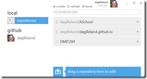

# Git (almost) Anywhere with GitHub for Windows

---
## Git (almost) Anywhere with GitHub for Windows

I was pleased to learn from [this article](http://haacked.com/archive/2012/05/30/using-github-for-windows-with-non-github-repositories.aspx) (by ***Phil Haack***, and yes, that's his real name and he is a prominent software developer) that you can use **[GitHub for Windows](http://msysgit.github.io/)** (**GHfW** or GH4W) on git repositories hosted on other 3rd party sites, such as [kiln](http://www.fogcreek.com/kiln/) or [Bitbucket](https://bitbucket.org/). That was especially cool to me, because <confession></confession>my allegiances are starting to shift from [mercurial](http://mercurial.selenic.com/) to [git](http://git-scm.com/). GHfW ([launched in May, 2012](http://haacked.com/archive/2012/05/21/introducing-github-for-windows.aspx)) is giving me the joy of git without the pain of reverting to [a bearded command-line guru](http://dilbert.com/strips/comic/2009-12-27/).

Just drag & drop the git clone url onto GitHub for Windows, and GHfW will do the rest for you. GHfW will prompt you for your username and password (If the domain is one that you haven't copied from before), so all you have to do is use the credentials that you have for that repository and start your download.

Now, there is only one (minor) catch with using GH4W with non-GitHub hosts: You have to have an account on the domain to download from that domain. If you're trying to clone some open-source repo from some place where you don't have a login account, you're going to have to do it the old-school way and clone it via the command line or git shell. Why? As Phil explains, it's because GHfW stores the login credentials:

> GHfW will securely store the credentials for this repository so that you only need to enter it once. GHfW acts as a credentials provider for Git so the credentials you enter here will also work with the command line as long as you launch it from theGit Shell shortcut that GHfW installs. That means you won't have to enter the credentials every time you push or pull commits from the server.

Cross-posted between [my personal blog](http://kb.gilleland.info/) and [my work blog](http://www.dmit.nait.ca/staff/dgilleland/).

---
