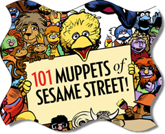

# Sesame Street Turns 40

---
## Sesame Street Turns 40

Yes, Sesame Street is celebrating 40 years of existence. I found out about it on Google (‘cause of their <!--Begin mp_html_link_1_a3ee740f-->search page1<!--End mp_html_link_1_a3ee740f-->). And, I found [this page](http://www.nationalpost.com/muppets/index.html) on the National Post. Do you know who the [101 Muppets of Sesame Street](http://www.nationalpost.com/muppets/index.html) are?

<!--Begin mp_html_detail_1_a3ee740f--> 
- Move
- Close

1<!--Begin mp_html_detail_body_1_a3ee740f--> 

# Google Search

Google often puts up special logos on their search page to commemorate events and holidays. I found their page for their [holiday logos](http://www.google.com/logos/index.html), but I haven't found their other event logos. Here's a screen capture of their Sesame Street logo.

<!--End mp_html_detail_body_1_a3ee740f-->
 <!--End mp_html_detail_1_a3ee740f-->

---
