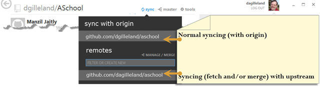

# Adding Remote Support in GitHub for Windows

---

## Adding Remote Support in GitHub for Windows

Here's hoping that this "open letter" (blog post, actually) to [**Phil Haack**](http://haacked.com/) and the [**GitHub for Windows**](http://windows.github.com/) team isn't taken as being too pushy ….

 

<unabashedFlattery>First, I gotta say that [GitHub for Windows](http://windows.github.com/) (GHfW) is making me a **huge fan** of both Git and [GitHub](https://github.com/)!!!</unabashedFlattery> As an instructor teaching computer programming to post-secondary students, tools like this are part of what make my job and my students' jobs *so* much easier!

 

What would make this tool the [Pièce de résistance](http://en.wikipedia.org/wiki/Pi%C3%A8ce_de_r%C3%A9sistance) for collaboration through forking and pull-requests would be the inclusion of **Upstream Syncing** in the GitHub for Windows tool. At present, if one has forked a repository so as to contribute through pull requests, they have to go to the shell and do a "`git fetch upstream`" and a "`git merge upstream/master`". I know, I know – that's not really a lot of work. But it can be easier. In fact, it could look like this:

 

 

Part of what gives [Open Source Software](https://www.google.ca/search?q=open+source+software&amp;oq=open+source+software&amp;aqs=chrome..69i57j5j69i65j69i60j69i61j0.2857j0j1&amp;sourceid=chrome&amp;ie=UTF-8#q=open+source+software&amp;safe=active&amp;tbm=nws) power and effect is the ability of people to contribute in the development of a project. In GitHub, you can do this easily by 1) [forking a project](https://help.github.com/articles/fork-a-repo), 2) adding your new feature or bug fix to your fork, and 3) submitting a [pull-request](https://help.github.com/articles/using-pull-requests) through your GitHub repo to the project you forked (known as the "upstream"). Pretty easy, huh? Except, maybe, for one thing: What if your fork is outdated, and you don't have the latest developments on the "upstream" project? You could be facing merge conflicts that you don't even know about, and your pull-request devolves into a series of discussions that boil down to "*please fetch & merge our latest work to resolve the conflicts and then we'll consider your pull request*". I think they call this a "[learning experience](http://en.wikipedia.org/wiki/Experiential_learning)" ([here](http://emailfunnypictures.files.wordpress.com/2010/04/tank2.jpg), [here](http://www.searchquotes.com/Learning_Experience/quotes/about/Pain/) and [here](https://www.google.ca/search?q=github+pull+request+problems&amp;oq=github+pull+request+problems&amp;aqs=chrome..69i57j0j69i64.9337j0j1&amp;sourceid=chrome&amp;ie=UTF-8#q=github+pull+request+merge+conflict+site:stackoverflow.com&amp;safe=active)).

 

As it currently stands, GHfW lets the developer quickly see if their repository fork is out of sync with their "origin" (the "central" repository, typically hosted online at wonderful hosts like GitHub). But what developers *don't see* is if they are out of sync with the "upstream". At present, I have to train my students to always do an upstream fetch and merge to see if there are any conflicts before they make a pull-request. Yes, I suppose it *is* my job to teach my students, but just think of how you can make my all our jobs easier through an extra GHfW feature: **Upstream Syncing**.

 

Oh, and thanks (in advance). 

 

Cross-posted between [my personal blog](http://kb.gilleland.info/) and [my staff website](http://www.dmit.nait.ca/staff/dgilleland).

---

