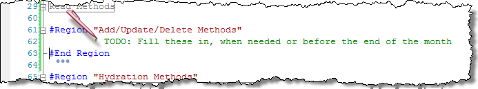
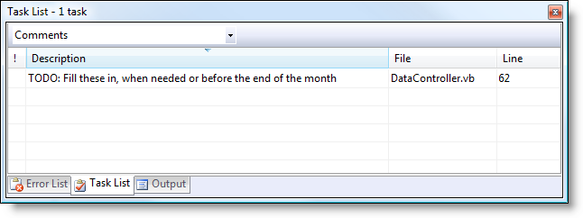

# Comments and Tasks in Visual Studio

---

## Comments and Tasks in Visual Studio

> *Updated Nov 20, 2009 – I added three more tokens that I've started using: RULE, TEST and CLEAN.*

You may or may not know that Visual Studio allows you to write comments that, when starting with a certain keyword (token), become Task items. The standard one is the TODO comment, like the following.

This produces an item in the Task List, which can be used to remind oneself of what to do. This is powerful in keeping the developer on-task for what has to be done while allowing him/her to focus on a train of thought by pushing "details" into comments. When it's time to get back to that TODO item, all one has to do is find it in the Task List and double-click it, which will jump you straight to the line of code for the task. Once you're finished the task, all you have to do is delete the comment, and it's removed from your Task List.

Remember that TODO from above? Well, it would look like this in the Task List.

Here's the great thing about this tool: it's possible to add your own comment/task list tokens! For example, because I find my coding & teaching often gets me learning new & cool things, I could add a token called "BLOG". That way, I can be reminded later on that I wanted to blog about something I was working on. [")](images/2009/WLW-CommentsandTasksinVisualStudio_193-image_2.png) When I'm done my other stuff, I can go back, look for something to blog (and blog it) and then delete the comment.

Here's a list of my Task List Tokens and how I use them:

- **TODAY** – This is an important task that I just have to do today, particularly if I'm expected to submit my code changes to the <!--Begin mp_html_link_1_1021a47d-->repository1<!--End mp_html_link_1_1021a47d-->.
- **FIXME** – This is something that needs fixing before that part of the program is ready to use. It's a known bug that needs addressing, but doesn't have to be done today.
- **REDO** –This is something that needs refactoring or improvements. It might be small, or it might be large. It's important enough that it needs to be noted, but it doesn't stop the product from shipping on time.
- **DOCUMENT** – This is a friendly reminder that I need to document my code, probably with some XML comments. It's a "low" priority item, mainly to be done when I'm otherwise brain dead or have some time to deal with it.
- **INFO** – This is a comment, note or reminder that might be of interest to someone who's going to inherit my project. Maybe I'm going on holidays, or I'm being moved around to help another project, and I want someone who comes after me to know what I was up to in a particular bit of code. It can be a great way to bring someone else up to speed on what I'm doing.
- **BLOG** – Well, you guessed it! This is for something that I want to blog about. Maybe it's a great insight or a design that will bring me acclaim and riches. Or (more likely) it's just something I want to remember or I think others might want to know about for a problem they're trying to fix or understand.
- **RULE** – If I'm on a roll for developing basic functionality, and want to remember some validation logic or business rule for later implementation, I can make a note of it with this token. It is helpful to me both for determining my tests as well as for catching the obscure edge tests that pop into my mind when I'm busy building some other area of my app.
- **TEST** – As a solo-developer, I don't aim at 100% code coverage (I don't test stuff that is too simple or that doesn't appear critical at the time). However, this task token is useful for when I know that I'll want to build some testing framework around it at a later time (for maintenance &/or peace of mind).  Yes, yes – I know that's not really the TDD way and that I should write my tests first. TDD is great, and I love it, but it's just not always practical for the solo developer. Hence this token.
- **CLEAN** – Here's another solo-developer thing. I know I should "clean up" unused code as I go, but time pressures and uncertainty can plague me when I don't have someone to help me think through my code. Sometimes I leave a bunch of code from older thought processes, because I'm not sure if I'll be wanting to come back to it and revive that code. It might be a bunch of methods, or just a couple lines of code. I can keep it around – for a while – but I know I'll probably want to do some clean-up at the end.

Well, there's my list! I hope you've found it useful. If you have any favorites of your own, just drop a comment and I'll post it for others to see.

<!--Begin mp_html_detail_1_1021a47d--> 
- Move
- Close

1<!--Begin mp_html_detail_body_1_1021a47d--> 

A Code Repository is a place to save your code and manage changes. [Subversion](http://en.wikipedia.org/wiki/Subversion_(software)) and [Mercurial](http://en.wikipedia.org/wiki/Mercurial) are popular tools for managing code repositories.

 <!--End mp_html_detail_body_1_1021a47d-->
 <!--End mp_html_detail_1_1021a47d-->

---

