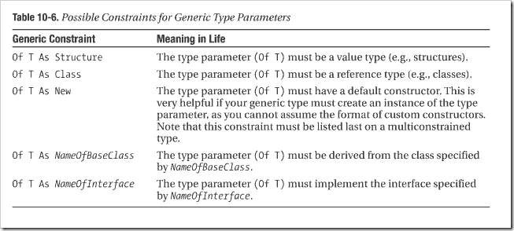
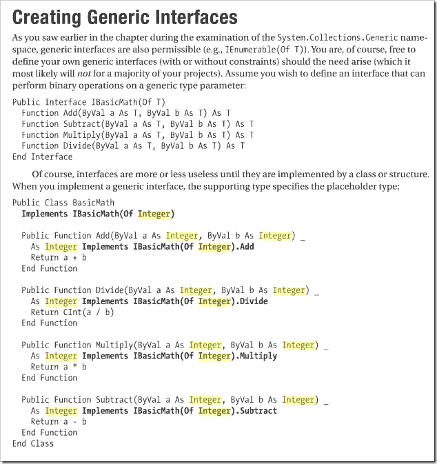

# Constraining Generics

---

## Constraining Generics

I love the generic types introduced in .net 2.0, and I knew that you could constrain the generic type by class name, but I didn't know you could do further constraints, such as that it must be a value type (Of T As Structure) or a reference type (Of T As Class). You can also specify the constraint that is must have a default constructor (Of T As New) or that it must implement a specific interface (Of T As NameOfInterface). Even cooler, you can combine these constraints!!!

I just LOVE .net :)

There is no constraints that the type must have an operator, but you could create an interface the specifies operations and make that interface a constraint. Here's an example:

Another cool item: Generic Delegates. Yes, you can apply generics to delegates & methods, giving you a lot of cool functionality. I won't go into that for now.

---

