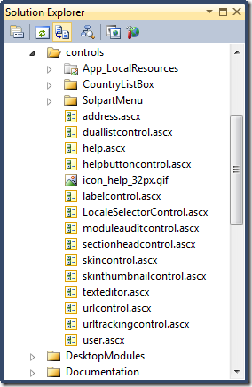
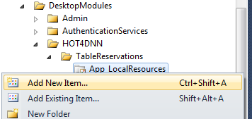
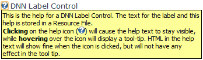
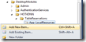

# Developing Edit User Controls for your DotNetNuke® Module

---
## Developing Edit User Controls for your DotNetNuke® Module

Part of creating module extensions for the DotNetNuke® framework involves developing a user interface (UI). Almost every module UI will include a user control to edit the module's content. This article walks through the key parts to developing an **Edit** user control for standard module extensions.

 

This article is part of a suite of articles on module development basics.

 
- Module Extensions – Building the UI  
 - UserControlBase   - PortalModuleBase   - ModuleSettingsBase   - ModuleInstanceContext   - View Controls   - Edit Controls   - Settings Control   - Resource Files (.resx)

 - Module Extensions – Building the Back End  
 - BLL – The Controller Class   - CBOs – Your Module-Specific "Info" Classes   - DAL – Provider-Specific Implementations

# Developing Edit User Controls
 

**Edit** user controls (for DotNetNuke® module extensions) have one major item in common with View user controls. Both of these controls inherit from PortalModuleBase. Another common characteristic is that the Edit control will have a Resource File for labels, etc. (just like the module's View control).

 

Beyond this, a module's Edit user control will take on different characteristics. First of all, the purpose of the Edit control is different from the View. The View is concerned with displaying or presenting the module's content. The Edit user control is all about creating or modifying the module's content. This means that Edit controls are essentially data entry forms for end-users.

 

Secondly, the View user control is intended to be accessible to any user with the View permission. In contrast, an Edit user control can only be accessed if the logged in user has Edit permissions. Further along these lines, the only way to navigate to an Edit control is through a link that identifies the control in the module (often the link is added to the Action menu of the View control).

 

Thirdly, Edit user controls tend not to implement any DNN® interfaces. A module's View will typically implement IActionable, in order to let the DNN framework query the control for items to add to the Action menu (such as a link to the module's Edit control). Edit controls don't usually implement IActionable. The purpose of an Edit control is very module-specific, and since there are no direct points of integration that the DNN framework at this level, there are no DNN interfaces to implement.

 

Lastly, an Edit user control will often make use of some DNN-specific user controls to provide a consistent "look and feel" with other DNN modules. Here are some of the DNN user controls commonly used by developers in their module's Edit control.

 
- **LabelControl** – This user control acts as both a label and a help resource for your users. It is a composite control that contains an ASP:Label along with a "Help" icon () that, when clicked or hovered over, provides additional instructions to your end-user. These label controls are often used in conjuncture with data entry controls, such as a TextBox or CheckBox control.  - **TextEditor** – This user control provides a rich-text editor which provides your users with a [WYSIWYG](mp1) way to create and edit HTML-formatted text.  - **SectionHeadControl** – This control provides expand/collapse functionality that allows an end-user to show or hide parts of the Edit form. This is a helpful control whenever your Edit control is large and has natural "sections" for data entry. This is the same control used on Page Settings, Module Settings, Site Settings, etc. to hide advanced settings or settings which are rarely changed.  - **HelpButtonControl** – This is similar to the LabelControl, but without the label. It displays a help icon which contains additional instructions. This is a great control to use alongside LinkButtons or other controls where some text is already present and an ASP:Label would simply be redundant.  - **DualListControl** – This is great for those times when you have a list of "available" items which a user could add or remove from some "assigned" or selected list. This is the same control used in the Site Settings by the Super User when making premium-level modules available to the individual portal.  - **ModuleAuditControl** – If your module tracks information on who created or last updated your module's data, then this is a handy control for displaying that information.  - **UrlControl** – This control provides a way for a user to select a link to internal or external resources. Internal resources include specific pages (tabs), files, images, or users. If the end-user has permissions to save files, this control can also be used to allow them to upload files and images to the portal. You can see a demo of the UrlControl on the Announcements module's Edit page.  - **UrlTrackingControl** – This control provides a consistent way to gather tracking information on links in your module's content for statistical purposes. It is sometimes used alongside the UrlControl.

 

The bulk of this article will walk through these key characteristics of Edit controls and show how they are usually implemented when creating DotNetNuke module extensions. Before discussing this, however, it's important to make note of how Edit user controls are called in a module.

 
## (Securely) Linking to Your Edit Control
 

Navigating among user controls in a module is not quite like navigating between pages in a regular ASP.NET web site. A regular ASP.NET website would handle navigation by simply linking to the other page (which would be a physical file on the site). Not so with DotNetNuke.

 

In DotNetNuke, the notion of distinct physical pages is an illusion, because the DNN framework intercepts and interprets the hyperlink to build individual pages "on the fly". There is effectively just one single physical page (~/default.aspx) and individual tabs or pages are distinguished by query string parameters. To understand how it works and how it relates to module development, it's important to highlight a number of differences about how all the pieces fit together in a DotNetNuke web site compared to regular web sites.

 

First of all, in DotNetNuke, "pages" (or "tabs") are made up of modules which are "injected" or loaded into a page by the DNN framework. Secondly, DotNetNuke needs to "know" something about the module in order to "grab" it and load it into a page; part of this information is contained in the ModuleDefinitions table where the module has been "registered" with the DNN framework. Thirdly, modules are made up of many user controls (.ascx), not "regular" pages (.aspx, .html, etc.); these controls must also be "registered" as part of the module's "definition".

 

All of this plays a part in building the links between user controls in a module. The View control, for example, could link to the Edit control by identifying the page (tabid=62), the module instance (mid=397) and the specific user control (ctl=Edit). All of this information would appear in the hyperlink's query string for the page. Shown in its traditional form, this page request could look like this.

 
&lt;a href="http://www.Hot4DNN.com/default.aspx?tabid=62&amp;mid=397&amp;ctl=Edit"&gt;Articles&lt;/a&gt;

<!--CRLF-->
 

Because DNN intercepts and interprets all page requests, it has full control on dynamically constructing a page. DotNetNuke also supports the notion of "Friendly URLs". Therefore, the link in the example above could be written as follows.

 
&lt;a href="http://www.Hot4DNN.com/tabid/62/mid/397/ctl/Edit/default.aspx"&gt;Articles&lt;/a&gt;

<!--CRLF-->
 

If the page for TabId 62 had the name "Articles", the link could also have been crafted to be even more "human friendly", as in the following code snippet.

 
&lt;a href="http://www.Hot4DNN.com/Articles/mid/397/ctl/Edit/default.aspx"&gt;Articles&lt;/a&gt;

<!--CRLF-->
 

The DNN framework offers two methods which help in creating these Friendly URLs: NavigateUrl() and EditUrl(). Either of these methods can be used, but the EditUrl() method is commonly used to create links to the Edit user control. For more information on EditUrl() and linking from the View control, see the article on "[Developing View User Controls](http://www.hot4dnn.com/Articles/tabid/62/articleType/ArticleView/articleId/43/Developing-View-User-Controls-for-your-DotNetNukereg-Module.aspx)".

 

These query strings can also used to provide information to the Edit control about the module's content. Take, for example, the Announcements module whose View renders a list of announcements. A pencil icon is shown beside existing announcements to allow editors to modify each individual announcement. The link to the Edit control contains a query string value (ItemId) identifying a specific announcement.

 

In general, it's a good idea to supply the minimal information needed when creating links between user controls in your module. Part of the reason for this is security. Everything you send over the query string is visible in the address bar as plain text to the end user. That's why sensitive information (like the UserId) should never be sent between user controls via query strings. (Besides, DNN already handles passing around the user information on page requests using other, more secure, means.)

 

If you are at all concerned about improving the security of your module, then it can be a good idea to perform extra checking on all the query string parameters that your Edit control is expecting. If anything looks unusual or suspicious (such as trying to edit data that does not exist for the module), you can throw a SecurityException. This will cause a re-direct back to the View of your module.

 

Another good idea is making use of Try/Catch blocks to handle any problems that might occur when handling the page request. The DNN framework offers a method called ProcessModuleLoadException() to relay any errors to the Event Viewer of the portal. The following code-behind illustrates both a SecurityException and the use of a try/catch.

 
Private Sub Page_Load(ByVal sender As System.Object, ByVal e As System.EventArgs) Handles MyBase.Load

<!--CRLF-->

        Try

<!--CRLF-->

            If Not (Request.QueryString("ReservationId") Is Nothing) Then

<!--CRLF-->

                Me.ReservationId = Int32.Parse(Request.QueryString("ReservationId"))

<!--CRLF-->

                Dim Controller As New ReservationController()

<!--CRLF-->

                Dim Info As ReservationInfo = Controller.GetReservation(ReservationId)

<!--CRLF-->

                If Info Is Nothing

<!--CRLF-->

                    ' Hmm, that's odd...

<!--CRLF-->

                    Throw New SecurityException() ' Treat as a potential "hack"

<!--CRLF-->

                Else

<!--CRLF-->

                    ' ... code to process reservation ...

<!--CRLF-->

                End If

<!--CRLF-->

            Else

<!--CRLF-->

                itemId = Convert.ToInt32(Common.Utilities.Null.NullInteger)

<!--CRLF-->

            End If

<!--CRLF-->

        Catch exc As Exception

<!--CRLF-->

            ProcessModuleException(Me, exc)

<!--CRLF-->

        End Try

<!--CRLF-->

    End Sub 

<!--CRLF-->
 
## Inherits PortalModuleBase
 

I've already written a good bit about PortalModuleBase in the articles on "[Developing View User Controls](http://www.hot4dnn.com/Articles/tabid/62/articleType/ArticleView/articleId/43/Developing-View-User-Controls-for-your-DotNetNukereg-Module.aspx)" and "[PortalModuleBase – Under the Hood](http://www.hot4dnn.com/Articles/tabid/62/articleType/ArticleView/articleId/47/PortalModuleBase-ndash-Under-the-Hood.aspx)". The following steps will create an Edit control for your module which inherits from PortalModuleBase.

 
1. Right-click on your module's folder and select "Add New Item…".   
--> img  - In the Add New Item dialog, select the Web User Control template and give it a name. For example, if your module manages Reservations and this control is meant to edit a single reservation, you could call it "EditReservation.ascx".   
--> img  - In the control's code-behind, replace the UserControl base class with PortalModuleBase.   
--> code

 

PortalModuleBase provides over 25 properties and a few methods which give contextual detail for your module, such as the ModuleId, TabId, PortalId, UserId and UserInfo, etc. Some of this information may be of particular interest to your module as you allow the user to edit the module's content. For example, many modules track the ModuleId as a foreign key column in their database table; this value would not be entered by the user, but is provided by the DotNetNuke framework when your user control inherits from PortalModuleBase.

 
## DotNetNuke User Controls
 

As mentioned already, there are a number of user controls available as part of the DotNetNuke framework for use in your data-entry forms. The DNN user controls are under the "~/controls/" folder in the website.

 

To use any of these controls to your form, simply view your .ascx file in either Split or Design mode and then drag the desired DNN control from the Solution Explorer onto your form.

 

This will add the control to the page and place a <%@ Register %> directive near the top of your form. I tend to modify the Register directive's TagPrefix attribute by changing it to "DNN" rather than the default "uc1"; it makes the following code easier to read later on.

 

[")](images/image.png)

 

I should note that the controls discussed here are all user controls (not server controls). DotNetNuke also offers a number of server controls, but I'll talk about those in another article.

 

Here's a short description of the more common DNN user controls, along with instructions on incorporating them into your module's Edit control. (I'll walk through a more detailed examination of all the DNN User and Server Controls in a later article.)

 
### LabelControl
 

Since the Edit control is all about letting end-users enter the data for your module's content, it should be no surprise that you'll need to provide labels for all the data input controls.

 

The DNN **LabelControl** is a perfect choice to provide direction to your end users. It displays both a label and a help icon () which users can hover over or click to get further directions for filling out the form. Best of all, it offers multi-lingual support (also called Localization support) through the use of Resource Files. The resource files provide the actual text for both the label and the help information. (I discuss the Resource Files more in the articles on "[Developing View User Controls](http://www.hot4dnn.com/Articles/tabid/62/articleType/ArticleView/articleId/43/Developing-View-User-Controls-for-your-DotNetNukereg-Module.aspx)" and "[PortalModuleBase – Under the Hood](http://www.hot4dnn.com/Articles/tabid/62/articleType/ArticleView/articleId/47/PortalModuleBase-ndash-Under-the-Hood.aspx)".)

 

When you drag the user control onto the form, all you will see is a help icon with an empty space to the right for the label's text. The following screen shot shows a sample label in the left column of a table with a textbox in the right column.

 

 

In the Resource File, you would enter two resource strings: one for the label's text and the other for the help text. The resource strings would have the same name, but different extensions (".Text" and ".Help"). The following screen shot shows the Resource File entries for the label control shown above.

 

 

To hook this control up to the resource file strings, simply set the ResourceKey attribute to the name of the resource string (without the extension), as shown in the following code snippet.

 
&lt;DNN:labelcontrol ID="SampleLabel" runat="server" ResourceKey="rsSampleLabel" /&gt;

<!--CRLF-->
 

When the control appears in the browser, the label's text will be shown and when the user hovers over the help icon, a tooltip will appear with further details.

 

 

If the user clicks on the help icon, the help text will be expanded into a panel with a yellow highlight. Notice that the resource string for the help text included HTML tags; these tags are ignored when hovering over the help icon, but are actually rendered in the expanded help panel.

 

 
### HelpButtonControl
 

The **HelpButtonControl** is like the DNN LabelControl but without the label. It's useful for placing alongside controls which would not normally have an associated label, such as LinkButton controls. Just as the LabelControl's help text was set using a ResourceKey attribute, the ResourceKey attribute must be set for the HelpButton.

 

Note that when this control is displayed on the page, there is no ToolTip displayed when you hover over the help icon. Help is displayed only by clicking the help icon. The following sample shows a HelpButton placed right after an <ASP:LinkButton> to provide additional information to the user.

 

 

The following mark-up shows the ResourceKey setting for this control.

 
&lt;DNN:helpbuttoncontrol ID="SampleHelpButton" runat="server" ResourceKey="SampleHelp" /&gt;

<!--CRLF-->
 
### TextEditor
 

[")](images/image.png)The **TextEditor** user control is all about letting the end user enter rich text (in HTML format) through a [WYSIWYG](mp1) editor. The DNN framework allows website owners (Super Users) to swap out the default text editor ([Telerik RadEditor](http://www.telerik.com/products/aspnet-ajax/editor.aspx "mp") since [DNN 5.4](http://www.dotnetnuke.com/Community/Blogs/tabid/825/EntryId/2569/Who-Moved-My-Cheese-ndash-DotNetNuke-Edition.aspx)) for their preferred editor (such as [CuteEditor](http://cutesoft.net/ASP.NET+WYSIWYG+Editor/ "mp") or [CKEditor](http://ckeditor.com/ "mp")). The DNN TextEditor control acts as a wrapper for the site's preferred rich text editor. This insulates your module development efforts; when you use the TextEditor user control, your module will use the website's preferred editor.

 

 

<< .Text Property in the code behind   
<< strip scripts, etc.   
<< encode/decode html

 

 

 

<< description >>

 

<< image >>

 

<< steps to add >> 1: register directive; 2: place control; 3: set attributes

 

<< using in your code-behind >>

 

<< integrating with your module >>

 
### SectionHeadControl
 

The DNN **SectionHeadControl** makes it easy for you to specify collapsible regions in your Edit control. This is especially helpful for modules that have complex content or a lot of data entry on the form. It helps with presenting a cleaner, less cluttered user interface.

 

 

To use this control, enclose the content you want to collapse into a 
 or <table>. It's important to add an ID and runat="server" attribute to the table or div, so that the SectionHeadControl can set its visibility on the server and through JavaScript in the browser. To associate the SectionHeadControl with your 
 or <table>, set the Section property to the ID of the 
 or <table>. Here's the code that produced the above sample image.

 
&lt;DNN:sectionheadcontrol ID="SampleSectionHead" runat="server" 

<!--CRLF-->

                            ResourceKey="SectionHead" Section="DivSection"

<!--CRLF-->

                            IncludeRule="true" IsExpanded="false" /&gt;

<!--CRLF-->

    &lt;div id="DivSection" runat="server"&gt;

<!--CRLF-->

        &lt;p&gt;Here, you can place a group of controls to gather related data.&lt;/p&gt;

<!--CRLF-->

        &lt;table&gt;

<!--CRLF-->

            &lt;tr&gt;

<!--CRLF-->

                &lt;td&gt;

<!--CRLF-->

                    &lt;DNN:labelcontrol ID="lblFirstName" runat="server" ResourceKey="GivenName" /&gt;

<!--CRLF-->

                &lt;/td&gt;

<!--CRLF-->

                &lt;td&gt;

<!--CRLF-->

                    &lt;asp:TextBox ID="FirstName" runat="server" /&gt;

<!--CRLF-->

                &lt;/td&gt;

<!--CRLF-->

            &lt;/tr&gt;

<!--CRLF-->

            &lt;tr&gt;

<!--CRLF-->

                &lt;td&gt;

<!--CRLF-->

                    &lt;DNN:labelcontrol ID="lblLastName" runat="server" ResourceKey="Surname" /&gt;

<!--CRLF-->

                &lt;/td&gt;

<!--CRLF-->

                &lt;td&gt;

<!--CRLF-->

                    &lt;asp:TextBox ID="LastName" runat="server" /&gt;

<!--CRLF-->

                &lt;/td&gt;

<!--CRLF-->

            &lt;/tr&gt;

<!--CRLF-->

            &lt;tr&gt;

<!--CRLF-->

                &lt;td&gt;

<!--CRLF-->

                    &lt;DNN:labelcontrol ID="lblAge" runat="server" ResourceKey="Age" /&gt;

<!--CRLF-->

                &lt;/td&gt;

<!--CRLF-->

                &lt;td&gt;

<!--CRLF-->

                    &lt;asp:TextBox ID="Age" runat="server" /&gt;

<!--CRLF-->

                &lt;/td&gt;

<!--CRLF-->

            &lt;/tr&gt;

<!--CRLF-->

        &lt;/table&gt;

<!--CRLF-->

    &lt;/div&gt;

<!--CRLF-->
 

Like many of the user controls available in DotNetNuke, the SectionHeadControl also uses the ResourceKey attribute. For this control, the ResourceKey's text will display next to the expand () and collapse () icons. There are a number of other attributes or properties which can be used for this control.

 
- **Section** – This is the ID of the 
 or <table> you want to collapse.  - **IncludeRule** – When set to true, this will display a horizontal rule just below the SectionHeadControl.  - **IsExpanded** – Set this to false if you want the section collapsed by default; otherwise, set it to true if you want the section expanded.  - **JavaScript** – You can add your own JavaScript to be fired when the Max/Min image is clicked. This might be helpful if you want something other than the default expand/collapse action of the SectionHeadControl. For example, you may want to include client-script that will add a timer to the expand/collapse effect.  - **MaxImageUrl** – You can set the URL for the image shown for the action that expands the section. By default, the MaxImageUrl is set to "~/images/plus.gif".  - **MinImageUrl** – You can set your own custom image for the action that collapses the section. By default, the MinImageUrl is set to "~/images/minus.gif".

 

 

<< description >>

 

<< image >>

 

<< steps to add >> 1: register directive; 2: place control; 3: set attributes

 

<< using in your code-behind >>

 

<< integrating with your module >>

 
### DualListControl
 

<< description >>

 

<< image >>

 

<< steps to add >> 1: register directive; 2: place control; 3: set attributes

 

<< using in your code-behind >>

 

<< integrating with your module >>

 
### ModuleAuditControl
 

<< description >>

 

<< image >>

 

<< steps to add >> 1: register directive; 2: place control; 3: set attributes

 

<< using in your code-behind >>

 

<< integrating with your module >>

 
### UrlControl
 

<< description >>

 

<< image >>

 

<< steps to add >> 1: register directive; 2: place control; 3: set attributes

 

<< using in your code-behind >>

 

<< integrating with your module >>

 
### UrlTrackingControl
 

<< description >>

 

<< image >>

 

<< steps to add >> 1: register directive; 2: place control; 3: set attributes

 

<< using in your code-behind >>

 

<< integrating with your module >>

 

 

 

 

[mp1]

 

**WYSIWYG** – "What You See Is What You Get"

 

[/mp1]

---
