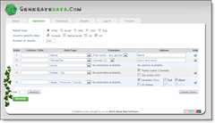

# GenerateData.com for your Sample Data Needs

---

## GenerateData.com for your Sample Data Needs

 For years, now, I have had a "hope-to-get-to" project idea of creating a program that will generate data for use in my databases that I give to my students. I would delve a little while into the idea, only to find time pressures & other work making me push it to the side. I would say to myself, "Eventually…."

Well, time has come again where I started raising that idea, and I decided (again) to do a quick Google search to see what others might have done. Lo and behold, there is a site out there by [Black Sheep Web Software](http://www.blacksheepsoft.com/#index) called [GenerateData.com](http://www.generatedata.com/#generator). It's written in JavaScript, PHP and MySQL, and it looks pretty cool! Even better, it's under a very nice GNU Open Source license (read it [here](http://www.generatedata.com/#gnu_license)) allowing for this to be copied/modified/redistributed. Perfect for my needs!

Now, all I need is the time to dive in and modify it. Eventually….

---

