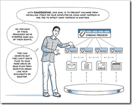

# Google Chrome – The Most Secure Browser Yet

---
## Google Chrome – The Most Secure Browser Yet

 I just had to make this post (after sending it to all my colleagues at work). It seems that in the Pwn2Own hacking contest, Google's Chrome was the only browser that wasn't hacked after the first day of the contest. As far as I know, it still hasn't been hacked. All of the other browsers were taken down in a very short time (minutes, I believe).

> "Safari was the first to fall, followed by Internet Explorer 8 on Windows 7. Firefox on Windows 7 x64 was also taken down, as was the iPhone's mobile Safari. Google Chrome, however, has yet to succumb." ([original article](http://www.downloadsquad.com/2010/03/25/pwn2own-2010-google-chrome-is-the-last-man-standing/))

So, you might be asking, "Why is Chrome so much more secure than any other browser?" The answer, my friend, is in a comic book. Yep. The comic book about Chrome. You can read it online at [http://www.google.com/googlebooks/chrome/](http://www.google.com/googlebooks/chrome/).

---
