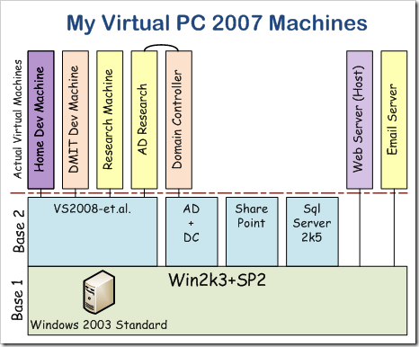

# My Development Virtual Machine

---
## My Development Virtual Machine

 A few years ago, I was blessed to win an MSDN subscription, and with it a number of development tools & OSes. Just recently, I started into building a collection of virtual computers for my own software development as well as for use on NAIT projects, so I thought I would take a moment to outline my dev computer's contents here.

***Note:** This list is still under development…*

- OS – Windows 2003 Server, Standard Edition      
 - IIS6
 - .NET Frameworks 2.0, 3.0, and 3.5
- Software      
 - [SQL Server 2005, Developer Edition](http://www.microsoft.com/sql/prodinfo/features/compare-features.mspx?PHPSESSID=0324345d45ef1bf1f764044e03584cd0) + SP2
 - Visual Studio 2008 Team System + [SP1](http://www.microsoft.com/downloads/details.aspx?FamilyID=27673c47-b3b5-4c67-bd99-84e525b5ce61&amp;displaylang=en)
  - SQL Express 2005
  - Free Add-ins:              
   - [AnkhSVN 2.0](http://ankhsvn.open.collab.net/)
   - [Versioning Controlled Build](http://www.codeproject.com/KB/macros/versioningcontrolledbuild.aspx)
   - [nUnit 2.5](http://www.nunit.org)
   - [Visual Basic Power Packs](http://msdn.microsoft.com/en-us/vbasic/bb735936.aspx)
   - [Silverlight Tools for VS2008 SP1](http://www.microsoft.com/downloads/details.aspx?FamilyId=c22d6a7b-546f-4407-8ef6-d60c8ee221ed&amp;displaylang=en) and [Silverlight Toolkit](http://download.codeplex.com/Project/Download/FileDownload.aspx?ProjectName=Silverlight&amp;DownloadId=62368&amp;FileTime=128818992804800000&amp;Build=15036)
   - [Telerik OpenAccess ORM Express](http://www.telerik.com/products/orm.aspx)
   - Alachisoft's [Tier Developer 6.1](http://www.alachisoft.com/tdev/index.html) ORM & Code Generator (which appears to be utilizing CodeSmith templates!)
  - Purcha$ed Add-ins:              
   - [Refactor! Pro](http://www.devexpress.com/Products/Visual_Studio_Add-in/Refactoring/index.xml) & [CodeRush](http://www.devexpress.com/Products/Visual_Studio_Add-in/Coding_Assistance/)
   - [TypeMock Isolator 5.3](http://www.typemock.com/Downloads.php)
  - ???              
   - Microsoft Blend
 - [Edit Plus 3](http://editplus.com)
 - [CodeSmith Professional 5.0](http://www.codesmithtools.com/)
 - [Beyond Compare 3](http://www.scootersoftware.com/)
 - [Google Chrome](http://www.google.com/chrome)
 - Silverlight 2.0
 - SnagIt 8 (the most recent version is [SnagIt 9](http://www.techsmith.com/screen-capture.asp), which has a lot of improvements!)
 - [Windows Live Writer 2009](http://download.live.com/writer) (installed through the [.msi](http://cid-f3d1cb89f9b6fc4f.skydrive.live.com/browse.aspx/Applications) as explained [here](http://www.newbtech.com/2009/04/windows-live-writer-2009-installing-on.html))
 - [WinRar](http://rarlabs.com/download.htm)

My overall approach is to use differencing disks, which allows me to have a base from which to create brand-new computers with all my regular software in under 5 minutes! I'm still building my system, but within this week, I'll have the base VHDs from which to make a number of virtual machines for the different projects I'm working on. The following diagram illustrates my current plan for what computers I'm hoping to set up.

---
