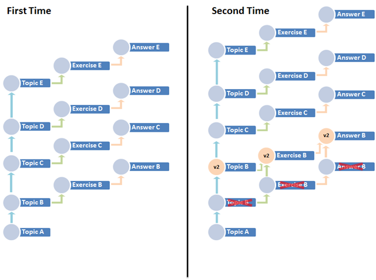
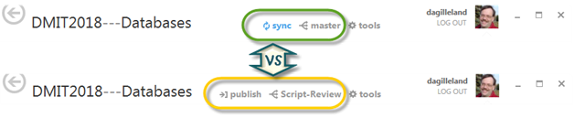

# Practical Push/Pull with Git & Mercurial

---
## Practical Push/Pull with Git & Mercurial

## Background

While I've worked on & off for the last few years with version control (using Mercurial, or hg, as my preferred DVCS), I've been playing out in my mind scenarios of ***how*** to use my DVCS. Since getting more into using git in the last couple of weeks, my scenario usage thots have been coalescing a bit more.

You see, most of the time I don't do "normal" development; the way I need to use DVCS is somewhat unique to my situation. Yes, I develop software. But the bulk of my work with software is as a *teacher* of computer programming. And using a DVCS in my curriculum delivery is a different sort of beast. Consider the following:

- **My revision history isn't *just* history** – I use tagged revision points as "starting kits" for in-class demonstrations and exercises. As such, I need to go back to these tagged revisions every term, and many times each term (depending on how many sections I have).
- **My revision history must change, but still be my "history"** – Since my tagged revisions are starting points for each class, I also have to deal with the fact that my curriculum can change term-by-term. So I need to update my tagged revisions with "newer versions" for the next term.
- **My revision history can't always be shared** – There are exercises and exercise solutions that I need to give my students, and I need to "hide" the answers from my students.

It's like this: History for me isn't just two-dimensional. It's **three**-dimensional. Maybe even four-dimensional. It's kinda like trying to get DVCS to help me represent not just history, but history in "alternate universes". Perhaps this graph will explain.

The first time through a course, the graph is simple. Branches for ***Topical*** demos, ***Exercises***, and ***Answers***. I can keep the ***Answers*** branch in my local repository while the others are published in a central repository that students can access.

The next time I offer the course, however, I might have bug fixes for particular ***Topics***, and those fixes might trickle down to the ***Exercises*** and ***Answers***. I also might want to do experimental branches for new topics or additional intermediate topics. The thing is, it just gets so messy so quickly.

So it's hard to know the best way to manage this. Do I lump topics in a single branch called "Topics", or do I put each topic in its own branch? What about topics that "build" on each other? Do I include the Exercises in the same branch as its related topic, or as separate branches? What about "hot fixes" mid-way through the course? Should I do clones/forks to separate each term that a course is offered?

It's not an easy set of decisions. Add to that the subtle and not-so-subtle differences between the way Mercurial and Git work in terms of branches and pushing/pulling, and the problem becomes more difficult to figure out. Remember – I need to step into a class and cherry-pick a tagged commit as my starter-kit-for-the-day.

## My Current Plan

First off, it seems the only way to deal with changes term-over-term is to just do a new fork or clone of the repository each time.

Secondly, it seems that each "starter kit" for a topic really needs to be in its own branch. In other words, topics are themselves branches. Exercises are probably best put into the topic branch they apply to, but answers *definitely* have to be in their own branch (to keep them isolated and hidden).

As to hot-fixes for topics part-way through the term, it's looking like "patches" are the best way to go, though I'm not yet practiced on using those.

## Getting Practical

Choosing between mercurial and git has been really hard. On one hand, mercurial allows multiple heads (git doesn't), and that could be a good thing in my starter-kit-for-the-day requirement. With multiple heads, each topic is effectively "open-ended" and I can treat them more independently. But perhaps that multiple head feature isn't quite as important, and I can go ahead and just use git with branches that never merge into the master. I'm not sure if it might make for a wonky looking tree in git, however, since git only works on the idea of a single head. Having to constantly bounce around to different revision tags is kinda like always changing heads.

On the other hand, the [rebase feature](http://git-scm.com/book/en/Git-Branching-Rebasing) of git is very appealing, not only in terms of potentially bringing in patches, but in terms of just presenting a "cleaner" revision tree. I believe that in mercurial, you can "kinda" get the equivalent of re-basing, though it isn't seen as "natural" among mercurial uses.

My biggest problem, I think, is just not being as experienced with either git or mercurial to make a reasonable choice. For now, the promise of "clean" revision trees and rebasing in git, along with the [easy-peasy](http://www.urbandictionary.com/define.php?term=easy%20peasy) way that you can use [GitHub for Windows](http://windows.github.com/) (students like "easy"), even with [non-GitHub hosts](http://kb.gilleland.info/Home/tabid/808/ctl/ArticleView/mid/1674/articleId/215/PageID/232/Git-almost-Anywhere-with-GitHub-for-Windows.aspx), makes me want to convert it all to git. Not that converting is all that hard – I use [Kiln](http://www.fogcreek.com/kiln/) by [FogCreek](http://www.fogcreek.com/), and their [Kiln Harmony](http://blog.fogcreek.com/announcing-kiln-harmony-the-future-of-dvcs/) makes switching between git & mercurial almost trivial. (My strange requirements might break that, though.)

### Tools of Choice

Picking tools for working with DVCS is important, because I don't want my students to get hung up on command-line stuff and lose the "big-picture" of what the course is really about. Therefore, the tool has to be simple, quick, and easy to use. For mercurial, my tool of choice is [**TortoiseHg**](http://tortoisehg.bitbucket.org/). The workbench has pretty much all I need, and it's easy to use (once you get over all the options and know what to focus on).

For git, I just have to recommend [**GitHub for Windows**](http://windows.github.com/) (GHfW). The interface is so clean and simple, it essentially hides the fact that you're driving the power of a first-class DVCS. At first, I was concerned because GHfW is integrated with GitHub, and I don't want students inadvertently sharing their labs (students can't afford paid hosting for private repos). But when I learned that [it can be used with non-GitHub hosts](http://kb.gilleland.info/Home/tabid/808/ctl/ArticleView/mid/1674/articleId/215/PageID/232/Git-almost-Anywhere-with-GitHub-for-Windows.aspx), my aversions have basically gone away.

### Hiding Branches

First things first. I gotta keep my exercise answers hidden from students. The key to that is branches. The trick to that is not pushing the branch to the public repository.

In git, this is really easy, since a push in git is branch-based by default. That is, a push or pull in git just does the *current* branch. With mercurial, however, the default is to push or pull all the branches; you have to be explicit if you only want a specific branch synchronized with your central repo.

GitHub makes this sweet and obvious. If the branch already exists in the central repo, your changes show up as a ***sync*** option. Branches that aren't in the central repo will be highlighted as ***publish*** (note to self: don't press that!).

In TortoiseHg, its not as obvious at first, but it is simple to isolate a particular branch (or even revision) for a push. Just select the ***Target*** checkbox and select the branch you want to push.

### Dealing with Patches

> This part is not yet developed. Stay tuned for future details.

### Cloning/Forking a New Semester

> This part is not yet developed. Stay tuned for future details.

* * *

Cross-posted between [my personal blog](http://kb.gilleland.info/) and [my work blog](http://www.dmit.nait.ca/staff/dgilleland/).       
Thanks for reading!

---
