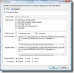

# Some Windows Live Writer Plug-Ins

---

## Some Windows Live Writer Plug-Ins

Here's some notes on some plug-ins for Windows Live Writer that I use, sometimes occasionally and sometimes frequently.

## Working

### Insert File(s)

The [Insert File(s)](http://gallery.live.com/liveItemDetail.aspx?li=b839fc2f-afa0-4728-8f54-cf4c0d3be8f5&amp;bt=9&amp;pl=8) plug-in can insert up to three files that will be uploaded to your blog (if your blog allows file uploading). Watch out for the file size, though, because the Publishing of your blog could time out…

xPollinate

The [xPollinate](http://gallery.live.com/liveItemDetail.aspx?li=c2bf1378-8b18-4a4e-880e-e399c8d7b7b4&amp;bt=9&amp;pl=8) plug-in simplifies the cross-posting of your blogs. Here's a screen-shot:

And here's some caveats about using xPollinate:

- Note that it requires you to first post your blog, then run xPollinate.
- If you make changes to or edit your original blog, then you will have to re-run xPollinate to cross-post those changes.
- If you re-run xPollinate, it will do the cross-postings as brand new postings (which is fine, if you want to "publish" it as an update to an earlier posting).

### Attach Zip File

[On the Fly Zip and Attach](http://gallery.live.com/liveItemDetail.aspx?li=d9449418-e352-4850-8398-458edece8e74&amp;bt=9&amp;pl=8) (which shows up as Attach Zip File)   Here's the caveats:

1. Make sure the total zip file size isn't too big – the Publishing will time out if it is
2. When zipping, it "preserves" the folder source for the zipped files – which can be thought of as a security breach (for example, it can expose the login user name if you are taking files from the desktop).

## Not Sure If Working…

tba

## Not Working

### LiveBlog Transfer

The [LiveBlog Transfer](http://gallery.live.com/liveItemDetail.aspx?li=0ceaf7be-9887-43c4-af18-6e7a3ef5fcc3&amp;bt=9&amp;pl=8) plug-in is supposed to allow either "backing up" blogs or transferring them to other blog sites. Read the comments, though, as there are problems with this plug-in on the Windows Live Writer 2009.

> TODO: See about re-making this program & fixing what appears broken.

### Smileys

The [Insert MSN, Yahoo and Custom Smileys](http://gallery.live.com/liveItemDetail.aspx?li=76de73f7-b3e9-48ee-9fd9-e9d4ee81f215&amp;bt=9&amp;pl=8) plugin seems to need one of these messenger tools installed – it's not working as a "stand-alone"

### Insert Google Maps

For some reason, [Insert Google Maps](http://gallery.live.com/liveItemDetail.aspx?li=c4b3945e-2f67-4653-a67f-152d3881624b&amp;bt=9&amp;pl=8) didn't work on my system.

---

