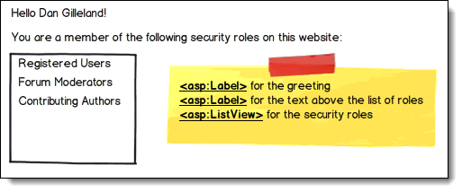
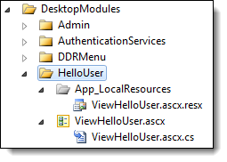
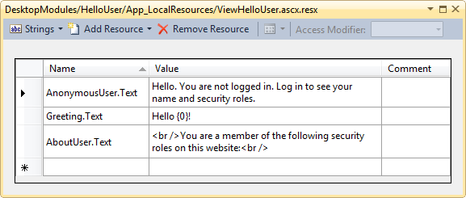
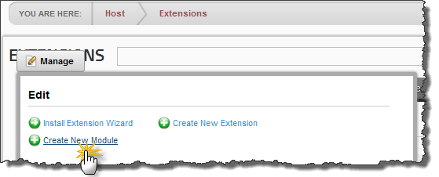
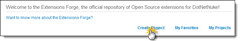
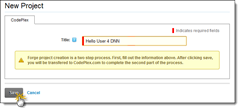
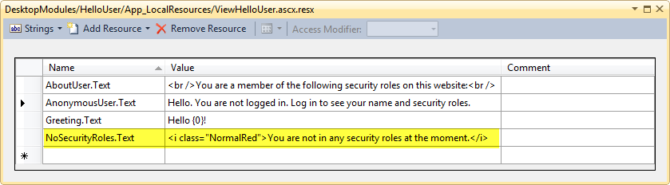
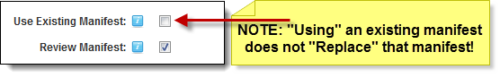

# Your First DotNetNuke Module

---
## Your First DotNetNuke Module

This **Hands-On-Tutorial** for **DotNetNuke®** walks you through creating a very simple module for DotNetNuke. Additionally, this article will show you how to install, test and package your module for distribution, followed by instructions on how to publish your module in the DotNetNuke Forge. Lastly, you will see how to package a version upgrade for your module.

 
## Hello User
 

In a spin on the traditional "Hello World" program, this DNN Module Extension will be an ultra-thin module with a minimal bit of functionality. Nevertheless, through this tiny module you will see the fundamentals of creating DNN Module Extensions, including

 
- Building on PortalModuleBase  - Using the DNN API  - Packaging your module  - Incorporating Language Internationalization  - Publishing in DNN Forge

 

The following mockup is a sketch of what the module will look like when its finished.

 

 
## Creating a (Simple) Module
 

To begin, open up Visual Studio and create a DotNetNuke website using the starter kit from DotNetNuke.Then add a blank C# module to your website with the name "HelloUser". (You can read more about this step in my article on [Getting Started with DotNetNuke Development](http://hot4dnn.com/Articles/tabid/62/articleType/ArticleView/articleId/56/Getting-Started-with-DotNetNuke-Development.aspx).)

 

This module has three files that we will have to edit.

 
- **ViewHelloUser.ascx** – This is the ASP.NET user control that will be the "view" for the module's content.  - **ViewHelloUser.ascx.cs** – This code-behind file will provide functionality for the module by injecting user-specific data into the module's controls.  - **ViewHelloUser.ascx.resx** – This is a Resource File (.resx) used for storing literal text values that will be used in the module.

 

The first step will be to edit the resource file. This file contains a dictionary (Name/Value pairs) of string literals that we will be accessing through our C# code. Double-click the **ViewHelloUser.ascx.resx** file and modify its contents to match the image below.

 

 

Next, edit the **ViewHelloUser.ascx** file to have the following markup. Note that we're just using a couple of labels and a ListView on this form – a nice, simple layout. The content for these controls will be provided in the code-behind of the file.

 
<%@ Control language="C#" Inherits="HOT4DNN.Modules.HelloUser.ViewHelloUser" 

    CodeFile="ViewHelloUser.ascx.cs" AutoEventWireup="true"%> 

    asp:Label id="Greeting" runat="server" />

    asp:Label id="AboutUser" runat="server" />

    asp:ListView ID="ActiveRoleList" runat="server">

        LayoutTemplate>

            div style="border:1px solid black;">

                div id="itemPlaceholder" runat="server" >div>

            div>

        LayoutTemplate>

        ItemTemplate>

            div><%# Container.DataItem %>div>

        ItemTemplate>

    asp:ListView>
 

In the code-behind file (**ViewHelloUser.ascx.cs**), enter the following code.

 
using System;using System.Collections.Generic;using DotNetNuke.Entities.Modules;using DotNetNuke.Services.Localization;using DotNetNuke.Security.Roles;using System.Web.UI.WebControls;namespace HOT4DNN.Modules.HelloUser{    partial class ViewHelloUser : PortalModuleBase    {        protected void Page_Load(System.Object sender, System.EventArgs e)        {            if (!Page.IsPostBack)            {                AboutUser.Text = Localization.GetString("AboutUser", LocalResourceFile);                string greetUser;                if (Request.IsAuthenticated)                {                    // Use the Greeting text                    greetUser = Localization.GetString("Greeting", LocalResourceFile);                    greetUser = string.Format(greetUser, UserInfo.DisplayName);                    // List the user's security roles                    RoleController rl = new RoleController();                    string[] roleNames = rl.GetRolesByUser(UserId, PortalId);                    ActiveRoleList.DataSource = roleNames;                    ActiveRoleList.DataBind();                }                else                {                    // Only show a general greeting to the anonymous user                    greetUser = Localization.GetString("AnonymousUser", LocalResourceFile);                    AboutUser.Visible = false;                    ActiveRoleList.Visible = false;                }                Greeting.Text = greetUser;            }        }    }}
 
### Understanding the Code
 

There's a few items to note about the C# code and DotNetNuke.

 
- The class inherits from **PortalModuleBase** rather than from System.Web.UI.UserControl directly.   
PortalModuleBase is a key part of the DotNetNuke API, and it exposes a rich set of properties to your module. With it, you have easy access to a lot of portal, page, and user-specific information. You can read more about this base class in the article [**PortalModuleBase – Under the Hood**](http://hot4dnn.com/Articles/tabid/62/articleType/ArticleView/articleId/47/PortalModuleBase-ndash-Under-the-Hood.aspx).  - The **UserInfo** property of your page is a DotNetNuke object with a rich set of information about the currently logged on user. In this module, we're placing the user's Display Name in the greeting string.  - The **Localization** class (from DotNetNuke.Services.Localization) allows you to access text from a resource file.   
Localization is all about making it possible for your module to support multiple languages, such as French or German, for your end-users. Notice that we make use of the **LocalResourceFile** property of the page, which by default points to the .resx file in your module's App\_LocalResources folder.  - The **RoleController** class (from DotNetNuke.Security.Roles) is used to get the list of security roles for the user. Notice that we are passing in the **UserId** and **PortalId** to the GetRolesByUser() method; these are more properties on your page, courtesy of PortalModuleBase.

 
## Testing Your Module
 

Testing your module is a matter of installing it into the DotNetNuke portal and adding it to a test page. The simplest way to do that is through the Extensions page in your website.

 

Launch the portal from Visual Studio by pressing [CTRL] + [F5] and log in as the SuperUser (or Host account). Navigate to the Extensions page under the Host tab. Then, hover over the "Manage" link and select "Create New Module".

 

 

In the Create Module From dialog, select "Control". Then select "HelloUser" from the Module Folder and "ViewHelloUser.ascx" from the Resource drop-downs. Enter a user-friendly module name and a description. Make sure you have selected the Add Test Page checkbox so that you can quickly build the test page with your module pre-added for you.

 

 

Click "Create Module" and you will be directed to the test page where you can view the module. By default, this test page will only be visible to Administrators, so you will need to change the page settings to allow all users to see it for testing purposes. Also, to properly test your module, you would need to create some security roles and a few test users, and then log onto the site as those users. Here's a screenshot of my own tests.

 

 
## Packaging Your Module
 

An important part of creating DotNetNuke modules is packaging the module for distribution. In order for others to load your module into their DotNetNuke installation, you must supply a zip file of all your files, including a DotNetNuke manifest (.dnn) that will guide the installation.

 

Once again, the Host > Extensions page will make that a snap! On the Extensions page, locate your module definition and click the Edit icon.

 

 

In the Package Settings for the module, enter some notes about this initial release and some contact information for the end-users. Note that the module's Version number defaults to version 01.00.00. Later, we'll publish an updated version using these same steps.

 

 

Click the Create Package link and this will start a wizard which will guide you through the steps. If you select the Review Manifest checkbox, the wizard will walk you through the following steps:

 
- **Choose Files to include** – Here you will see the .ascx, .ascx.cs and .resx files created earlier.  - **Choose Assemblies to include** – A list of the related DLLs for your module are shown here.  - **Create Manifest** – The DNN manifest is shown here in a text box, allowing you to perform any manual edits to the installation manifest.  - **Create Package** – In this step, you will specify the name of the Manifest File and the .zip that holds your distribution package.  - **Create Package Results** – This final page of the wizard shows the results of creating the manifest and the zip file along with information on where the distribution package will be found (typically in the ~Install/Module/ folder of your portal).

 

Each of these steps are illustrated in the following screenshots (click to expand the image).   

 

 
## Publishing in DotNetNuke Forge
 

The [DotNetNuke Extension Forge](http://www.dotnetnuke.com/Community/Extensions-Forge.aspx) is a "community repository for Open Source extensions (modules, providers, skins, etc) for the DotNetNuke platform." If you have a user account at [DotNetNuke](http://www.DotNetNuke.com) (free registration), then you can publish & promote your module there.

 

The steps to publishing to the Forge are outlined in this [video](http://www.dotnetnuke.com/Resources/Video-Library/Viewer/VideoId/73/Create-An-DotNetNuke-Extensions-Forge-Project.aspx) and [wiki](http://www.dotnetnuke.com/Resources/Wiki/Page/Forge.aspx). You can also learn more through the [Task Manager video (Part 4)](http://www.dotnetnuke.com/Resources/Video-Library/Viewer/VideoId/263/Part-4-Creating-A-Project-In-The-DotNetNuke-Forge.aspx). For brevity, here are the main steps:

 
1. Log onto DotNetNuke and navigate to the [Extensions Forge](http://www.dotnetnuke.com/Community/Extensions-Forge.aspx) page. Then, click the Create Project link.   
- Enter in a title for the new project and click Save.   
- Create your new project on CodePlex.   
- Agree to the terms, choose a license, upload your DotNetNuke package (.zip) along with any source code, and then publish your project.

 

By default, DotNetNuke Forge will synchronize with CodePlex on a daily basis to publish new releases. You can manage the details of your release through CodePlex and through the DotNetNuke Forge.

 
## Module Versioning and Upgrades
 

It's pretty common to want to release an upgraded version of your module. DotNetNuke handles version upgrades quite smoothly. All you need to do is publish your new release under a higher module number! Simple, right?!

 

Actually, it can get a bit more involved when you include SQL scripts to install database components for your module. It's important to remember that when you publish module upgrades, your end-users might be installing it over-top of a previous version or as a completely fresh install. As such, planning your upgrade takes a bit of time and thought. I plan to cover the details of how to do this in a later article. For now, let me walk you through the basic steps of creating a new version of your module.

 
### Change your code
 

First, make any changes you deem necessary for your module. In the case of "Hello User", add an EmptyDataTemplate to the ListView control.

 
asp:ListView ID="ActiveRoleList" runat="server">    EmptyDataTemplate>        asp:Literal ID="NoData" runat="server" />    EmptyDataTemplate>
 

Next, modify the C# code in the Page\_Load() method, immediately after the call to ActiveRoleList.DataBind(), as follows.

 
ActiveRoleList.DataSource = roleNames;ActiveRoleList.DataBind();Literal noData = ActiveRoleList.FindControl("NoData") as Literal;if (noData != null)    noData.Text = Localization.GetString("NoSecurityRoles", LocalResourceFile);
 

Finally, add a new string in your .resx file for the "NoSecurityRoles" localization text.

 

 
### Re-Create Your Module Package
 

Once you've modified and tested your module, go through the same steps as earlier for packaging your module. All you have to remember to do is to change the Version Number for your module (in this case, I'm changing it to 01.00.01). It might be a good idea to ***not*** use the existing manifest when running through the Create Package wizard; if you do, you need to be aware that *using* the existing manifest does *not* mean replacing that manifest.

 

 

In any case, be sure to review the manifest and the final zip package to make sure it's got all the parts you expect. When you're done with the wizard, push your latest changes to CodePlex and upload the new zipped package.

 

 

Hopefully, you've found this tutorial helpful in creating your first DotNetNuke module. Look for further articles and **Hands-On-Tutorials** in [**HOT4DNN.com**](http://HOT4DNN.com).

---
