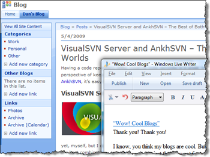
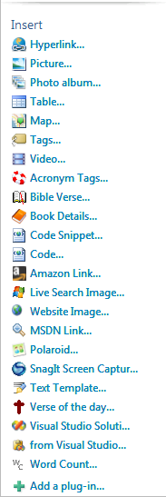

# "Wow! Cool Blogs"

---

## "Wow! Cool Blogs"

Thank you! Thank you!

I know, you think my blogs are cool. But what's way cool about them is not just that they got ***fancy images*** and are so ***professional and well-written***. What's cool is that I write it all off-line, using Windows Live Writer (WLW), and then post it up when I'm satisfied with it. I use it for any blog I want: **SharePoint**, WordPress, [DotNetNuke](http://www.DotNetNuke.com) portals, whatever!

I can also edit previous blogs with WLW, and since WLW can run on my USB drive, I can write this from anywhere I want! There's a whole suite of other features available via WLW plug-ins, including doing

- Code snippets right out of Visual Studio,
- Polaroid-style pictures,
- Maps from Virtual Earth,
- Video inserts,
- Amazon Links (for those books you like – don't forget your referral id!),
- and much, much more!

.

---

