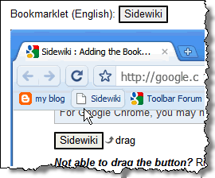
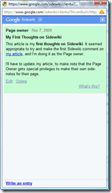

# Google’s Sidewiki

---

## Google’s Sidewiki

 I just stumbled upon [Google’s Sidewiki](http://googleblog.blogspot.com/2009/09/help-and-learn-from-others-as-you.html) and [installed it](http://www.google.com/support/toolbar/bin/answer.py?hl=en&amp;answer=164493) on my Chrome browser. It looks pretty good. It might spark a bit of a debate, however. It has the potential to turn the whole of the web into a sort of wiki or semi-social media site.

## Pros

On the positive side, it is a great way for my students to comment and give feedback on the stuff I post. Based on what they say, I can make improvements to what I’ve published. Furthermore, they can then share their insights with one another, without having to wait for me to find their comments and make the improvements I suggest.

Likewise, people can share their insights on pages that don’t provide a feedback or comments form. It can potentially add a lot of value to a given web page.

> <EDIT>
> 
> 
> 
>  **Author’s Note**: I just tried doing a [Sidewiki entry on this article](https:/www.google.com/sidewiki/clientui?hl=en&amp;url=http://kb.gilleland.info/Home/tabid/808/ctl/ArticleView/mid/1674/articleId/164/PageID/181/Googlersquos-Sidewiki.aspx), and discovered that I was recognized as the owner of the site (pretty cool!). It turns out that as the page owner, you can make your own Sidewiki entries, even with [HTML](http://www.google.com/support/toolbar/bin/answer.py?hl=en&amp;answer=163222). This can be a great help in allowing the page owner to express their comments and have them show prominently in Sidewiki.
> 
> 
> 
> </EDIT>

## Cons

I see some potential pitfalls.

- Some people don’t want to have people doing Sidewiki publications on their page. Is there a way that they can prevent this?
- How is any page author going to monitor this? It somewhat circumvents the idea of Moderated Posts that some sites have, such as blogging and Forum sites.
- It’s hard to get people to agree (and harder to know who’s really right). Again, Sidewiki could get really tough to monitor. And who would be responsible for any [libel](http://www.answers.com/libel) suits? Would Google be culpable, if they don’t respond in a <!--Begin mp_html_link_1_cbb0f9b1-->timely manner1<!--End mp_html_link_1_cbb0f9b1--> to complaints by the page owners?
- And what about sites like Experts Exchange? How would they feel if some people started posting the answers they’re hiding from unregistered users? I bet they would get up in arms over that pretty quick.
- What would Google’s policy be for “unfair competition”? For example, what if a bunch of people started using Sidewiki on [Google’s search page](http://www.Google.com) to state that they actually prefer [Bing](http://www.Bing.com) or [Yahoo](http://www.Yahoo.com)?

Basically, the big complaint I see is where the page or website owner takes <!--Begin mp_html_link_2_cbb0f9b1-->umbrage2<!--End mp_html_link_2_cbb0f9b1--> over what is perceived as an intrusive association on their site by others. Is it really right to make the whole of the Internet a wiki?

<!--Begin mp_html_detail_1_cbb0f9b1--> 
- Move
- Close

1<!--Begin mp_html_detail_body_1_cbb0f9b1--> 

# A Timely Response to Complaints

How much time is a “timely” response for complaints on the Internet. If it’s a concern of [libel](http://www.answers.com/libel), then there could be a problem for some folks, because in Internet terms, it doesn’t take much time at all for something to spread.

<!--End mp_html_detail_body_1_cbb0f9b1-->
 <!--End mp_html_detail_1_cbb0f9b1--><!--Begin mp_html_detail_2_cbb0f9b1--> 
- Move
- Close

2<!--Begin mp_html_detail_body_2_cbb0f9b1--> 

## Umbrage

It’s not too often I get to use that word, so I thought I would. It basically means “offence”, and a person who “takes umbrage” to something is kinda upset or annoyed over it.

For more, check out the [definition on Answers.com](http://www.answers.com/topic/umbrage).

<!--End mp_html_detail_body_2_cbb0f9b1-->
 <!--End mp_html_detail_2_cbb0f9b1--> 

---

