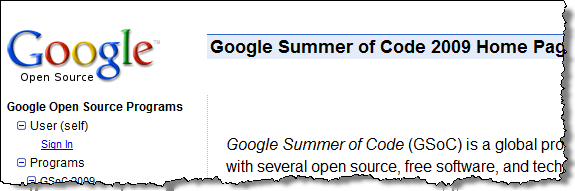

# My 2009 Summer of Code

---

## My 2009 Summer of Code

Well, here I am at the end of another term and going into my May/June “Intercession” time. During Intercession, instructors will do all sorts of “housecleaning” stuff, like getting ready for teaching in September, cleaning their office space, taking some short one & two day courses, etc.

This summer, many of us will be actively working on curriculum development, and I find myself looking at our 2nd & 3rd term programming courses and dreaming of what they could be. Since I’ll be working on these, it seems a good idea to get my own “Summer Of Code” going, like Google does.

There’s a few things I would like to learn, and things I would like to develop for my students. I want to give some really good practices for my students to learn & apply in their post-graduate careers, and a couple of hallmark things I would love for them to learn is TDD (Test Driven Development) and Design Patterns. There’s a couple of really good sources I’m looking at exploring as I work a bit on my [Star Trek game project](http://code.google.com/p/star-trek-oop).

Here’s some other thoughts I want to capture as I transition to this summer:

- Re-build my machine. I want to only run a virtual machine.
- Come up with a scheme for blogging & writing articles (I’ve got so many locations, both personal and Work, and I need to consolidate).       
***Update:** I’ve pretty much decided on my blogging/writing scheme to post as much as possible on**my personal “Knowledge Bank”**. For articles that I have in other places, my knowledge bank (**http://kb.Gilleland.info**) will be just a mirror for those postings.*
- Make some cool software!!

---

