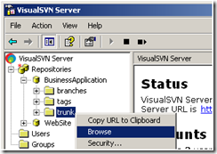
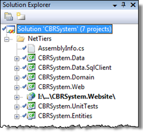

# VisualSVN Server and AnkhSVN – The Best of Both Worlds

---

## VisualSVN Server and AnkhSVN – The Best of Both Worlds

Having a code repository while creating code samples is a great team idea, and makes sense from the perspective of keeping everyone up-to-date and coordinated on the code. Thanks to [VisualSVN Server](http://www.visualsvn.com/server/) and [AnkhSVN](http://ankhsvn.open.collab.net/), it’s easy to get up & running.

## VisualSVN Server

The makers of VisualSVN actually have two products: A pay-for client plug-in for Visual Studio (called VisualSVN) and a free server app (called [VisualSVN Server](http://www.visualsvn.com/server/)). Of course, I’m recommending the server app. What’s so nice about this is that all the regular hoopla in setting up a Subversion server (particularly for a Windows environment) is all done for you through a short & to-the-point installer. I haven’t tried it yet, myself, but I do know that they have a good reputation, and from my research they appear to be one of the best combinations of price/maturity out there.

From their own pages, they state:

>  “*VisualSVN Server is a package that contains everything you need to install, configure and manage Subversion server for your team on Windows platform. It includes Subversion, Apache and a management console.          
> You can use any Subversion client to connect to VisualSVN Server or a web browser to quickly browse though repositories. …**VisualSVN Server is less than 6MB in size and can be downloaded and installed in a couple of minutes with just few clicks.*”

## AnkhSVN

[AnkhSVN](http://ankhsvn.open.collab.net/) is a free plug-in for Visual Studio that acts as a Subversion client, which makes it a perfect companion to VisualSVN Server. This is a product I have used, and am currently using in a project on [CodePlex](http://www.codeplex.com/). It works well, and its integration with Visual Studio is quite seamless  (even alongside the built-in components of the Team System version of Visual Studio, which I’m running). It’s a full-featured SVN client.

---

