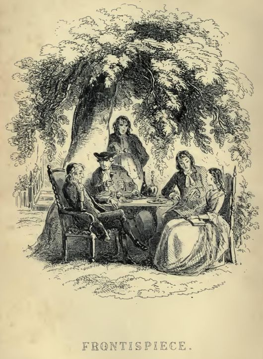
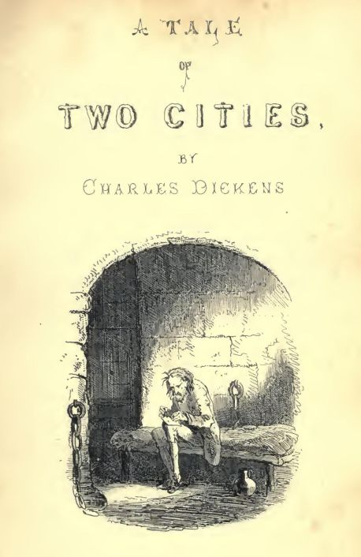

<pre xml:space="preserve">The Project Gutenberg EBook of A Tale of Two Cities, by Charles Dickens

This eBook is for the use of anyone anywhere at no cost and with
almost no restrictions whatsoever.  You may copy it, give it away or
re-use it under the terms of the Project Gutenberg License included
with this eBook or online at www.gutenberg.org

Title: A Tale of Two Cities
       A Story of the French Revolution

Author: Charles Dickens

Release Date: November 28, 2004 [EBook #98]
Last Updated: September 25, 2016

Language: English

Character set encoding: UTF-8

*** START OF THIS PROJECT GUTENBERG EBOOK A TALE OF TWO CITIES ***

Produced by Judith Boss, and David Widger

</pre>

* * *

# A TALE OF TWO CITIES

## A STORY OF THE FRENCH REVOLUTION

## By Charles Dickens

  

##### [_Original_](images/0403.jpg)

  

##### [_Original_](images/0404.jpg)

